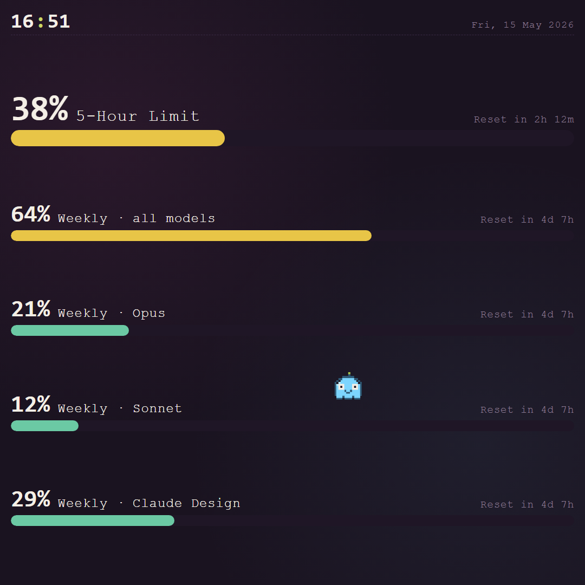

# agentView Examples

[](https://github.com/agentview-de/agentview-examples/actions/workflows/ci.yml)
[](LICENSE)

Copyable examples for building agentView displays — both **visual
templates** (single-file HTML displays) and **complete applications**
(end-to-end integrations that push live data into a display via the
agentView REST API).

agentView delivers HTML or URLs to smart displays such as TVs,
tablets, monitors, and kiosk screens. These examples are meant to be
small, readable starting points that you can preview in a browser and
adapt for your own screen.

## Two flavours

### `examples/` — Visual templates

Single-file HTML displays you can preview, customise, and send to a
screen. Each folder is a standalone display with a `display.html`,
optional `assets/` and a screenshot.

| Example | Description |
| --- | --- |
| [Café Menu Board](examples/cafe-menu-board/) | Digital menu board for restaurants and cafés with categories, prices, daily special. |
| [Company KPI Board](examples/company-kpi-board/) | Corporate dashboard tracking metrics, goals, and team announcements. |
| [Craft Beer Taplist](examples/craft-beer-taplist/) | Dynamic taplist for breweries and pubs with ABV, IBU, style colors, pricing. |
| [Fast Food Menu Board](examples/fastfood-menu-board/) | Digital order menu for fast food and quick-service restaurants, animated promos. |
| [Gym Schedule Board](examples/gym-schedule-board/) | Fitness center schedule with real-time class status and trainer info. |
| [Hello World](examples/hello-world/) | Cinematic starter display with ambient animation and an elegant clock. |
| [Hotel Concierge Board](examples/hotel-concierge-board/) | Lobby display with weather, local tips, flight departures, events. |
| [Local Info Board](examples/local-info-board/) | Configurable local dashboard with weather, air quality, daylight data, headlines. |
| [Manufacturing Shift Board](examples/manufacturing-shift-board/) | Industrial status board for shift targets, safety metrics, machine status. |
| [Patient Queue Board](examples/patient-queue-board/) | Waiting room display with current ticket numbers and room assignments. |
| [Real Estate Exposé](examples/real-estate-expose/) | Storefront display traversing property listings with images and key details. |
| [Smart Home Wall Dashboard](examples/smart-home-wall-dashboard/) | Wall-tablet dashboard with a premium dark-glass UI for weather, calendar, energy, devices. |
| [Smart Home Wall Dashboard (Light)](examples/smart-home-wall-dashboard-light/) | The original wall-tablet dashboard featuring a bright, clean aesthetic. |
| [Transit Board](examples/transit-board/) | Real-time departure board for public transport with customizable modes and delays. |

### `applications/` — Complete integrations

Full reference applications that pull data from one source and push
it onto an agentView display via the public REST API. Each
application bundles its own display HTML and ships a runnable client
(desktop app, CLI, or script).

| Application | What it does | Stack |
| --- | --- | --- |
| [Token Counter](applications/token-counter/) | Streams your live **Claude plan usage** (5-hour limit, weekly aggregate, per-model splits) onto an agentView display every two minutes. Includes a Tamagotchi-style ghost mascot that reacts to the highest usage bucket. | .NET 10 Windows tray app · [prebuilt .exe in Releases](https://github.com/agentview-de/agentview-examples/releases?q=token-counter) |

## Featured preview

[](applications/token-counter/)

More screenshots live in the individual folders. The Token Counter
display is also served live at
<https://agentview-de.github.io/agentview-examples/applications/token-counter/display.html>.

## Set up your first display

1. Open https://display.agentview.de on your target screen, such as a TV, tablet, or monitor.
2. A pairing code appears on the display.
3. Open the agentView dashboard at https://agentview.de.
4. Open `New display`, enter a display name and the pairing code, then create the display.
5. Your screen is linked to your account and ready to receive content.

## Use a visual template

Each `examples/<name>/` folder is a standalone display.

1. Open the example folder.
2. Preview `display.html` in your browser.
3. Customize the copy, layout, colors, and data for your own use case.

### Send with the dashboard

1. Open the agentView dashboard at https://agentview.de.
2. Open your display.
3. Click `Send`.
4. Switch to the `HTML` tab.
5. Paste the contents of the example `display.html`.
6. Click `Send HTML now`.

If the example includes an `assets/` folder, open `My Files` in the
dashboard and upload the asset files first. Copy each asset URL and
replace the matching relative path in the HTML before pasting.

### Send with an AI agent

1. Connect your AI agent to agentView through MCP at https://agentview.de/mcp.
2. Ask the agent to send one of these examples to your display.
3. Tell the agent what you want to change, such as the text, layout, colors, or data.

### Send with the REST API

Use the REST API when you want custom automation or server-to-server
delivery. Start with the developer docs at
<https://agentview.de/developers.html>.

## Run a complete application

The Token Counter is the first end-to-end application in this repo.
Each application folder ships its own quick-start. For the
recommended .NET tray app:

```powershell
cd applications/token-counter/dotnet
dotnet publish src\AgentViewTokenCounter\AgentViewTokenCounter.csproj `
    -c Release -r win-x64 -o dist
.\dist\AgentViewTokenCounter.exe
```

Walk the setup wizard and the bridge starts streaming usage every
two minutes. Full walkthrough in
[`applications/token-counter/README.md`](applications/token-counter/).

## agentView links

- Dashboard: https://agentview.de
- Display pairing page: https://display.agentview.de
- MCP endpoint: https://agentview.de/mcp
- Developer docs: https://agentview.de/developers.html
- Agent instructions: https://agentview.de/agent-instructions
- Swagger UI: https://agentview.de/swagger
- API status: https://agentview.de/api/status

## Content format

Most examples in this repository are single-file HTML displays.
agentView renders uploaded HTML fullscreen on the display. Examples
may include inline CSS and JavaScript, and some examples may load
external resources such as fonts, images, scripts, or public APIs.

The Token Counter application ships its display.html as an
**embedded resource** inside the `.exe` and uploads it on first
publish, so users never have to copy-paste the HTML manually.

## Example guidelines

New examples should work as small finished displays, not just code
snippets.

- Keep the first screen useful and readable.
- Prefer no build step unless the example needs one.
- Use sample data when an external API would otherwise be required.
- Keep secrets out of the repository.
- Document the simplest way to preview and send the example.

Applications (under `applications/`) may require a build step. They
should ship a `README.md` with a 5-minute quick start, a screenshot,
and a clear note about any external service the bridge depends on.

## Disclaimer + Security

This repository ships **reference code** for the public agentView REST
API. Some applications integrate with third-party services; those
integrations are best-effort and not affiliated with the third-party
vendor. See:

- [`DISCLAIMER.md`](DISCLAIMER.md) — scope, names, "as is" terms.
- [`SECURITY.md`](SECURITY.md) — how to report security findings.

## Contributing

This repository will grow organically. New examples should stay easy
to copy, easy to preview, and focused on one display idea. New
applications should pick one data source, one display, and make
end-to-end setup achievable in under ten minutes.

## License

[MIT](LICENSE).
