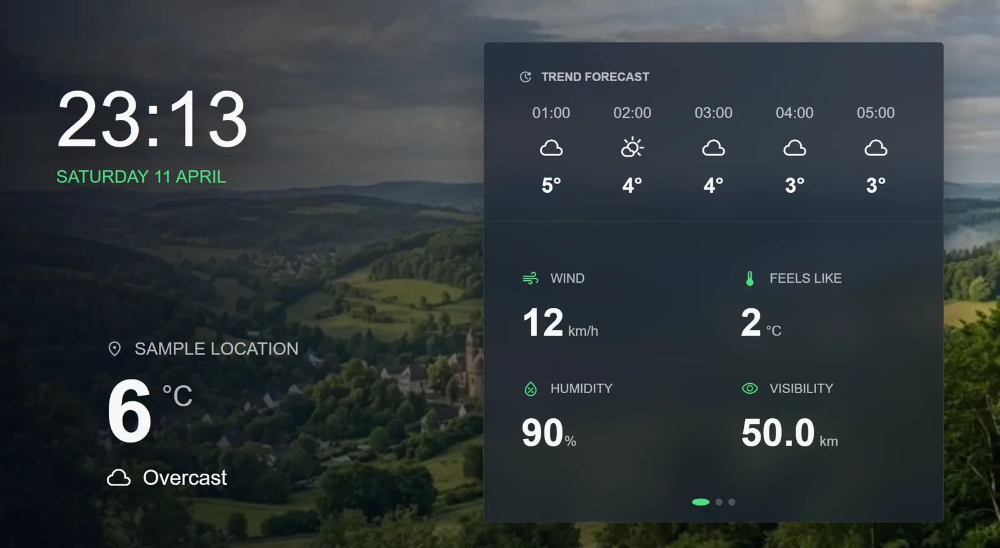

# agentView Examples

Copyable examples for building browser-based agentView displays.

agentView delivers HTML or URLs to smart displays such as TVs, tablets, monitors, and kiosk screens. These examples are meant to be small, readable starting points that you can preview in a browser and adapt for your own screen.

## Examples

| Example | Description |
| --- | --- |
| [Hello World](examples/hello-world/) | A polished starter display with a live clock and no build step. |
| [Local Info Board](examples/local-info-board/) | A configurable local dashboard with weather, air quality, daylight data, and headlines. |
| [Smart Home Wall Dashboard](examples/smart-home-wall-dashboard/) | A wall-tablet dashboard for weather, calendar, energy, room climate, devices, and security. |
| [Café Menu Board](examples/cafe-menu-board/) | A digital menu board for restaurants and cafés with categories, prices, daily special, and branding. |

## Featured preview

More screenshots live in the individual example folders.

## Set up your first display

1. Open https://display.agentview.de on your target screen, such as a TV, tablet, or monitor.
2. A pairing code appears on the display.
3. Open the agentView dashboard at https://agentview.de.
4. Open `New display`, enter a display name and the pairing code, then create the display.
5. Your screen is linked to your account and ready to receive content.

## Use an example

Each example is a standalone display that should be easy to inspect and copy.

1. Open the example folder.
2. Preview `display.html` in your browser.
3. Customize the copy, layout, colors, and data for your own use case.

### Send with the dashboard

1. Open the agentView dashboard at https://agentview.de.
2. Open your display.
3. Click `Send`.
4. Switch to the `HTML` tab.
5. Paste the contents of the example `display.html`.
6. Click `Send HTML now`.

If the example includes an `assets/` folder, open `My Files` in the dashboard and upload the asset files first. Copy each asset URL and replace the matching relative path in the HTML before pasting.

### Send with an AI agent

1. Connect your AI agent to agentView through MCP at https://agentview.de/mcp.
2. Ask the agent to send one of these examples to your display.
3. Tell the agent what you want to change, such as the text, layout, colors, or data.

### Send with the REST API

Use the REST API when you want custom automation or server-to-server delivery. Start with the developer docs at https://agentview.de/developers.html.

## agentView links

- Dashboard: https://agentview.de
- Display pairing page: https://display.agentview.de
- MCP endpoint: https://agentview.de/mcp
- Developer docs: https://agentview.de/developers.html
- Agent instructions: https://agentview.de/agent-instructions
- Swagger UI: https://agentview.de/swagger
- API status: https://agentview.de/api/status

## Content format

Most examples in this repository are single-file HTML displays. agentView renders uploaded HTML fullscreen on the display. Examples may include inline CSS and JavaScript, and some examples may load external resources such as fonts, images, scripts, or public APIs.

## Example guidelines

New examples should work as small finished displays, not just code snippets.

- Keep the first screen useful and readable.
- Prefer no build step unless the example needs one.
- Use sample data when an external API would otherwise be required.
- Keep secrets out of the repository.
- Document the simplest way to preview and send the example.

## Contributing

This repository will grow organically. New examples should stay easy to copy, easy to preview, and focused on one display idea.
