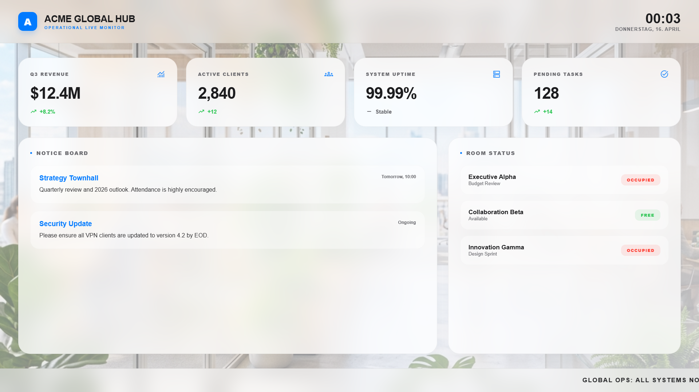

# Company KPI Board

A cleanly designed corporate dashboard template for internal communication. It features 4 top-level KPIs with trend indicators, a scrolling stock/news ticker, an announcements board, and real-time meeting room statuses.

## Preview

Open [`display.html`](display.html) in your browser. If your browser blocks local JSON files from `file://`, serve this folder with a local static server.

## Send to agentView

Follow the setup and send instructions in the [repository README](../../README.md).

If you upload this through the dashboard, upload the files in `assets/` first and replace the matching relative paths in the HTML with the asset URLs from agentView.

## Customize

> **Tip:** The easiest way to customize this display is with an AI agent connected via [MCP](https://agentview.de/mcp). Share the example files with the agent, describe what you want to change, and the agent will adapt and send it to your display.

Edit `config.json` to change the theme colors, KPIs, announcements, rooms, and branding. When sending through the dashboard, edit the matching `defaultConfig` object in the `<script>` section instead.

| Setting | Config key |
| --- | --- |
| Company name | `companyName` |
| Top-level KPI cards | `kpis` |
| Meeting room statuses | `meetingRooms` |
| Text for the scrolling ticker | `ticker` |
| Active announcements | `announcements` |
| Theme Colors | `theme` |
| Optional live JSON feed or agentView Data Slot | `dataUrl` |
| Refresh interval in seconds | `refreshInterval` |

## Optional Data Slot

Set `dataUrl` to a public agentView Data Slot URL to feed live data from your CRM or calendar tools directly into the dashboard JSON. Missing keys fall back to the sample data.
