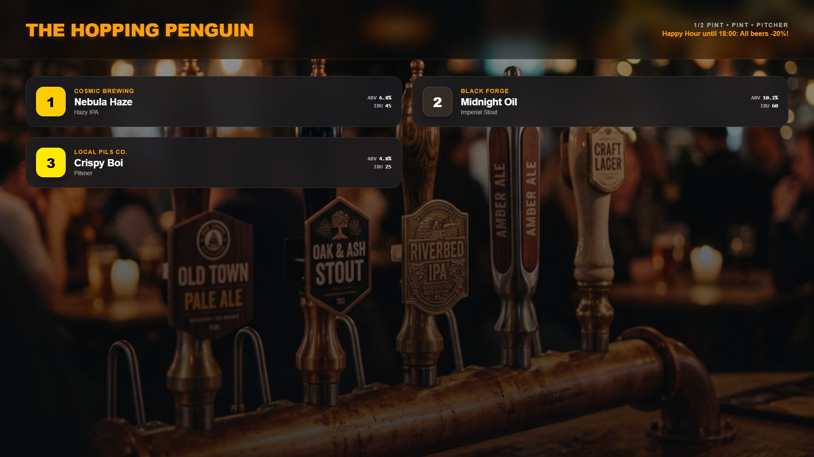

# Craft Beer Taplist

A rich, dark slate digital signage template perfect for craft breweries, taprooms, and pubs. It displays an easily legible, 2-column list of beers including brewery names, styles, ABV, and IBU metrics. Each tap number is beautifully accented by a circle whose background matches the beer's unique color profile (e.g. dark brown for stouts, gold for pilsners).

## Preview

Open [`display.html`](display.html) in your browser. If your browser blocks local JSON files from `file://`, serve this folder with a local static server.

## Send to agentView

Follow the setup and send instructions in the [repository README](../../README.md).

If you upload this through the dashboard, upload the files in `assets/` first and replace the matching relative paths in the HTML with the asset URLs from agentView.

## Customize

> **Tip:** The easiest way to customize this display is with an AI agent connected via [MCP](https://agentview.de/mcp). Share the example files with the agent, describe what you want to change, and the agent will adapt and send it to your display.

Edit `config.json` to alter the bar name, available sizes, specials, and the tap list. When sending through the dashboard, edit the matching `defaultConfig` object in the `<script>` section instead.

| Setting | Config key |
| --- | --- |
| Bar / Pub Name | `barName` |
| List of Beers on Tap | `taps` |
| Available Pour Sizes | `sizes` |
| Specials or Happy Hour text | `specials` |
| Theme Colors | `theme` |
| Optional live JSON feed or agentView Data Slot | `dataUrl` |
| Refresh interval in seconds | `refreshInterval` |

## Color Configuration

Each beer in the `taps` array has a `color` property (e.g., `"#f1c40f"`). The template automatically adjusts the text color inside the tap number circle to ensure maximum contrast (black text on light beer colors, white text on dark stouts) so you never have to worry about readability.
