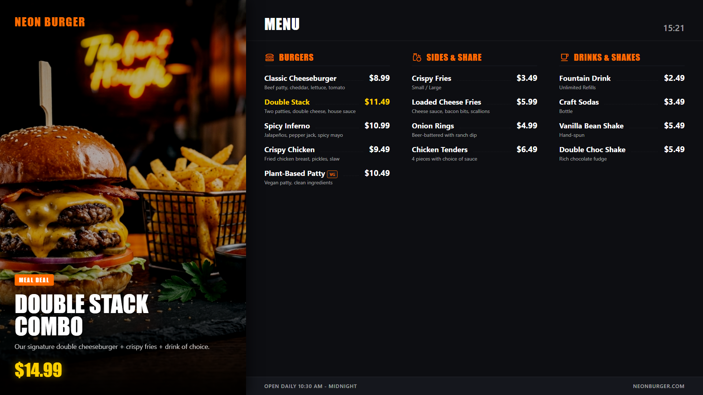

# Fast Food Menu Board

A modern, highly dynamic digital menu board template specifically designed for counter or checkout areas. It features a sleek dark mode design with vibrant neon accents, tailored for fast food spots or burger joints.



## Preview

Open `display.html` in your browser. If your browser blocks local JSON files from `file://`, serve this folder with a local static server.

## Send to agentView

Follow the setup and send instructions in the [repository README](../../README.md).

If you upload this through the dashboard, upload the files in `assets/` first and replace the matching relative paths in the HTML with the asset URLs from agentView.

## Customize

> **Tip:** The easiest way to customize this display is with an AI agent connected via [MCP](https://agentview.de/mcp). Share the example files with the agent, describe what you want to change, and the agent will adapt and send it to your display.

Edit `config.json` to change the theme colors, promotions, menu items, and branding. When sending through the dashboard, edit the matching `defaultConfig` object in the `<script>` section instead.

| Setting | Config key |
| --- | --- |
| Restaurant name | `restaurantName` |
| Currency symbol | `currency` |
| Locale for clock format | `locale` |
| Theme colors (Background, Accent, etc.) | `theme` |
| Rotating promotions | `promotions` |
| Rotation interval in seconds | `promotionRotationInterval` |
| Menu categories and items | `menu` |
| Footer (Hours, Website) | `footer` |
| Optional live JSON feed or agentView Data Slot | `dataUrl` |
| Refresh interval in seconds | `refreshInterval` |

## Menu item format

Each item in a category can have:

```json
{
  "name": "Double Stack",
  "details": "Two patties, double cheese, house sauce",
  "price": 11.49,
  "highlight": true,
  "tags": ["Popular"]
}
```

The `details`, `highlight`, and `tags` fields are optional. `highlight` sets the price and name color to the secondary accent color, while `tags` are shown as small badges next to the item name.

## Optional Data Slot

Set `dataUrl` to a public agentView Data Slot URL such as `/data/u/your-public-slug/burger-menu.json`. The JSON can contain any subset of the same keys as `config.json`; missing keys fall back to the sample data.
