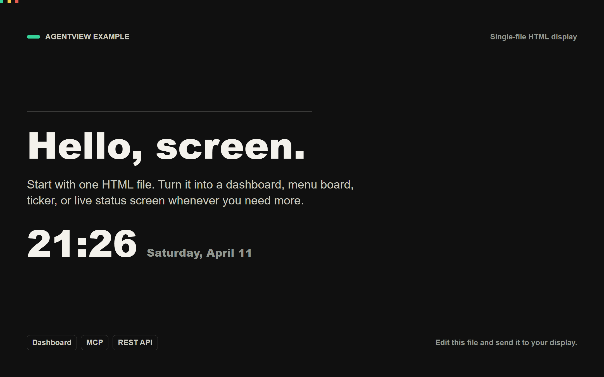

# Hello World

A polished starter display for AgentView. It uses one fullscreen HTML file with a small amount of vanilla JavaScript for the live clock and date.

## Preview

Open `index.html` in your browser.

## Send to AgentView

Follow the setup and send instructions in the [repository README](../../README.md).

## Customize

Edit `index.html` and change the headline, message, colors, or layout. No build step is required.
