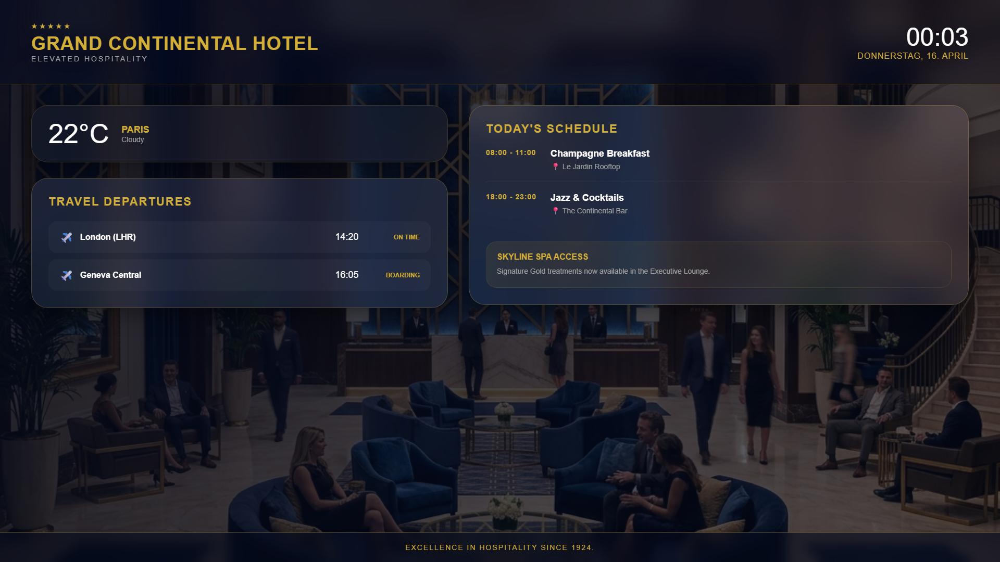

# Hotel Concierge Board

An elegant, premium digital signage template designed for hotel lobbies and premium lounges. It combines local weather information, real-time transportation/flight statuses, today's schedule of events, and a concierge notice board.

## Preview

Open [`display.html`](display.html) in your browser. If your browser blocks local JSON files from `file://`, serve this folder with a local static server.

## Send to agentView

Follow the setup and send instructions in the [repository README](../../README.md).

If you upload this through the dashboard, upload the files in `assets/` first and replace the matching relative paths in the HTML with the asset URLs from agentView.

## Customize

> **Tip:** The easiest way to customize this display is with an AI agent connected via [MCP](https://agentview.de/mcp). Share the example files with the agent, describe what you want to change, and the agent will adapt and send it to your display.

Edit `config.json` to alter the hotel name, events, and notices. When sending through the dashboard, edit the matching `defaultConfig` object in the `<script>` section instead.

| Setting | Config key |
| --- | --- |
| Hotel Name | `hotelName` |
| Weather | `weather` |
| Transportation departures | `transport` |
| Today's Events | `events` |
| Concierge Notices | `notices` |
| Theme Colors | `theme` |
| Optional live JSON feed or agentView Data Slot | `dataUrl` |
| Refresh interval in seconds | `refreshInterval` |
