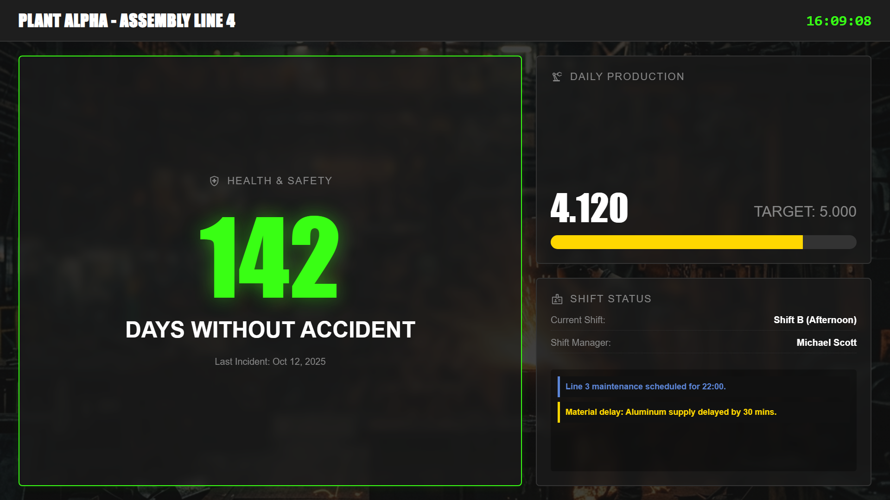

# Manufacturing Shift Board

An industrial, high-contrast digital signage template focused on the factory floor. It displays critical health and safety metrics (e.g., "Days without accident" in huge font), real-time production targets vs. actual progress, current shift management details, and operational alerts.

## Preview

Open `display.html` in your browser. If your browser blocks local JSON files from `file://`, serve this folder with a local static server.

## Send to agentView

Follow the setup and send instructions in the [repository README](../../README.md).

If you upload this through the dashboard, upload the files in `assets/` first and replace the matching relative paths in the HTML with the asset URLs from agentView.

## Customize

> **Tip:** The easiest way to customize this display is with an AI agent connected via [MCP](https://agentview.de/mcp). Share the example files with the agent, describe what you want to change, and the agent will adapt and send it to your display.

Edit `config.json` to alter the plant name, safety days, current shift, and active alerts. When sending through the dashboard, edit the matching `defaultConfig` object in the `<script>` section instead.

| Setting | Config key |
| --- | --- |
| Facility/Plant Name | `plantName` |
| Health & Safety | `safety` |
| Production KPIs | `production` |
| Shift details | `shift` |
| Real-time Alerts | `alerts` |
| Theme Colors | `theme` |
| Optional live JSON feed or agentView Data Slot | `dataUrl` |
| Refresh interval in seconds | `refreshInterval` |

## Optional Data Slot

Set `dataUrl` to a public agentView Data Slot URL. This is especially useful for linking a SCADA/MES system webhook directly to the `production.current` value to see the progress bar animate live on the floor.
