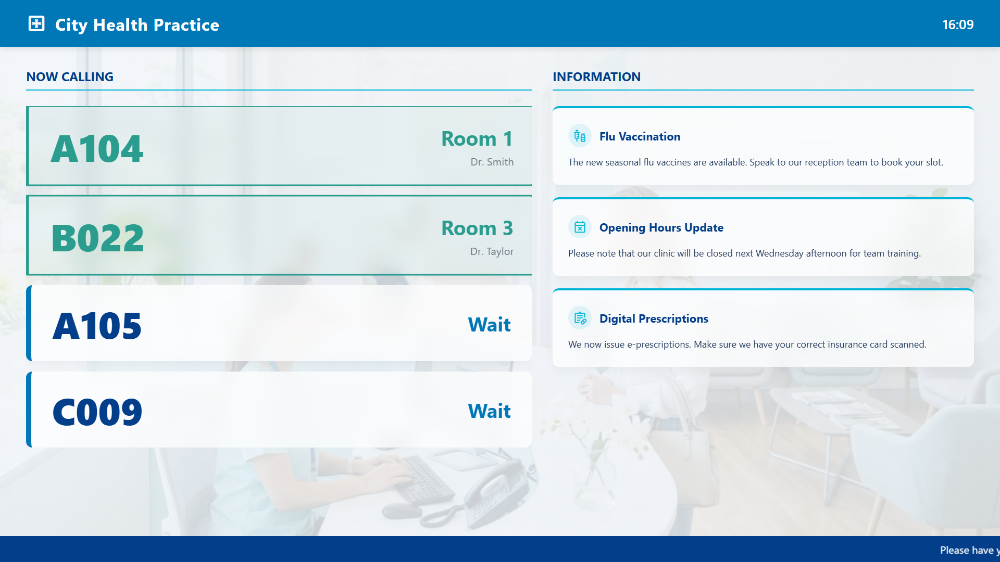

# Patient Queue Board

A clean, legible, and trustworthy digital signage template for doctor's offices, clinics, or pharmacies. It prioritizes clarity by showing the current ticket numbers being called next to a secondary panel containing public health notices or clinic updates.



## Preview

Open [`display.html`](display.html) in your browser. If your browser blocks local JSON files from `file://`, serve this folder with a local static server.

## Send to agentView

Follow the setup and send instructions in the [repository README](../../README.md).

If you upload this through the dashboard, upload the files in `assets/` first and replace the matching relative paths in the HTML with the asset URLs from agentView.

## Customize

> **Tip:** The easiest way to customize this display is with an AI agent connected via [MCP](https://agentview.de/mcp). Share the example files with the agent, describe what you want to change, and the agent will adapt and send it to your display.

Edit `config.json` to alter the clinic name, current calling queue, and notices. When sending through the dashboard, edit the matching `defaultConfig` object in the `<script>` section instead.

| Setting | Config key |
| --- | --- |
| Clinic Name | `clinicName` |
| Calling Queue / Tickets | `calls` |
| Health Notices & Tips | `notices` |
| Scrolling Ticker | `ticker` |
| Theme Colors | `theme` |
| Optional live JSON feed or agentView Data Slot | `dataUrl` |
| Refresh interval in seconds | `refreshInterval` |

## Ticket Configuration

The `calls` array is the heart of the queue manager. Items with `"status": "now"` are visually highlighted as currently playing/active, while `"status": "next"` items are shown as upcoming.

```json
{
  "ticket": "A104", 
  "room": "Room 1", 
  "doctor": "Dr. Smith", 
  "status": "now" 
}
```
