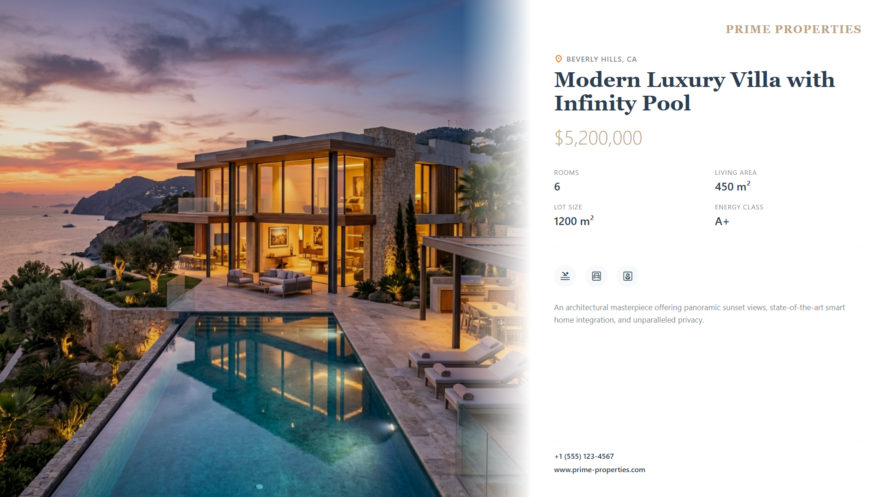

# Real Estate Exposé

A premium, elegant display designed specifically for real estate firm window fronts. It smoothly transitions between high-resolution property images with a subtle Ken Burns effect, alongside structured tabular key statistics and agency branding.



## Preview

Open `display.html` in your browser. If your browser blocks local JSON files from `file://`, serve this folder with a local static server.

## Send to agentView

Follow the setup and send instructions in the [repository README](../../README.md).

If you upload this through the dashboard, upload the files in `assets/` first and replace the matching relative paths in the HTML with the asset URLs from agentView.

## Customize

> **Tip:** The easiest way to customize this display is with an AI agent connected via [MCP](https://agentview.de/mcp). Share the example files with the agent, describe what you want to change, and the agent will adapt and send it to your display.

Edit `config.json` to alter the agency branding, property list, and key statistics. When sending through the dashboard, edit the matching `defaultConfig` object in the `<script>` section instead.

| Setting | Config key |
| --- | --- |
| Agency Name | `agencyName` |
| List of exact properties | `properties` |
| Contact details | `contact` |
| Theme Colors | `theme` |
| Slide rotation speed | `slideInterval` |
| Optional live JSON feed or agentView Data Slot | `dataUrl` |

## Property Configuration

Each property object in the `properties` array expects the following:

```json
{
  "title": "Modern Luxury Villa with Infinity Pool",
  "location": "Beverly Hills, CA",
  "price": "$5,200,000",
  "stats": [
    { "label": "Rooms", "value": "6" },
    { "label": "Living Area", "value": "450 m²" }
  ],
  "features": ["pool", "garage", "garden"],
  "description": "An architectural masterpiece...",
  "image": "./assets/house.png"
}
```
