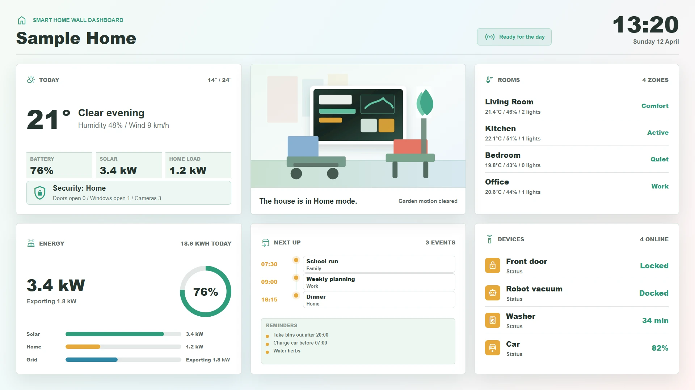

# Smart Home Wall Dashboard

A fullscreen wall-tablet display for smart homes. It combines time, weather, calendar, energy, room climate, device status, security, and household tasks in one glanceable view.

## Preview

Open `display.html` in your browser. If your browser blocks local JSON files from `file://`, serve this folder with a local static server.

## Send to agentView

Follow the setup and send instructions in the [repository README](../../README.md).

If you upload this through the dashboard, upload the files in `assets/` first and replace the matching relative paths in the HTML with the asset URLs from agentView.

## Customize

> **Tip:** The easiest way to customize this display is with an AI agent connected via [MCP](https://agentview.de/mcp). Share the example files with the agent, describe what you want to change, and the agent will adapt and send it to your display.

Edit `config.json` to change labels, locale, images, sample data, or the optional JSON feed. When sending through the dashboard, edit the matching `defaultConfig` object in the `<script>` section instead.

| Setting | Config key |
| --- | --- |
| Home name, timezone, locale | `homeName`, `timezone`, `locale` |
| Icon font URL | `fontUrl` |
| Scene image URL | `sceneImage` |
| Optional live JSON feed or agentView Data Slot | `dataUrl` |
| Refresh interval in seconds | `refreshInterval` |
| Weather summary | `weather` |
| Solar, battery, home load, grid status | `energy` |
| Alarm mode, doors, windows, cameras | `security` |
| Family or work schedule | `calendar` |
| Room climate and lighting | `rooms` |
| Household devices | `devices` |
| Household reminders | `tasks` |

## Optional Data Slot

Set `dataUrl` to a public agentView Data Slot URL such as `/data/u/your-public-slug/smart-home.json`. The JSON can contain any subset of the same keys as `config.json`; missing keys fall back to the sample data.
