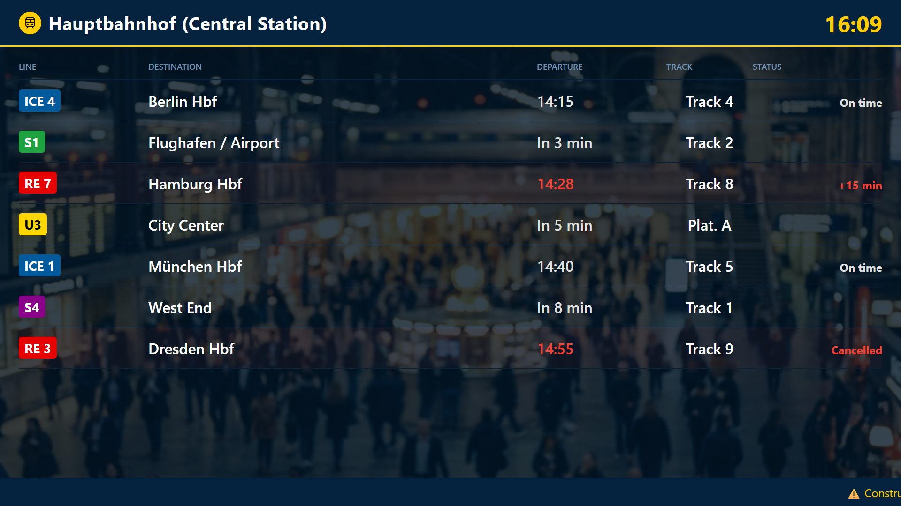

# Public Transit Monitor

A high-contrast, universally legible digital signage template designed for public spaces, corporate lobbies, or station platforms. It displays real-time departures, automatically coloring line badges to match their distinct brand colors, and highlights delayed/cancelled trains with pulsing visual cues.

## Preview

Open [`display.html`](display.html) in your browser. If your browser blocks local JSON files from `file://`, serve this folder with a local static server.

## Send to agentView

Follow the setup and send instructions in the [repository README](../../README.md).

If you upload this through the dashboard, upload the files in `assets/` first and replace the matching relative paths in the HTML with the asset URLs from agentView.

## Customize

> **Tip:** The easiest way to customize this display is with an AI agent connected via [MCP](https://agentview.de/mcp). Share the example files with the agent, describe what you want to change, and the agent will adapt and send it to your display.

Edit `config.json` to alter the station name, departures table, and alert ticker. When sending through the dashboard, edit the matching `defaultConfig` object in the `<script>` section instead.

| Setting | Config key |
| --- | --- |
| Station Name / Location | `stationName` |
| List of departures | `departures` |
| Alert ticker / disruptions | `alerts` |
| Theme Colors | `theme` |
| Optional live JSON feed or agentView Data Slot | `dataUrl` |
| Refresh interval in seconds | `refreshInterval` |

## Live Data Integration

This template shines when connected to an API! You can set `dataUrl` to a script or agentView Data Slot that forwards live GTFS (General Transit Feed Specification) or local transit API data to display live departures. The template automatically calculates contrasting text colors for line badges based on the `color` hex codes.
